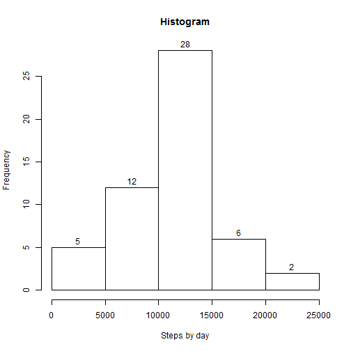

# Reproducible Research: Peer Assessment 1
*unzip the activity.zip to activity.csv before running*

## Loading and preprocessing the data

```r
library(ggplot2)
library(chron)
```
### raw data without filling missing value 

```r
act0<-read.csv("activity.csv")
```
### Missing values

```r
summary(act0)
```

```
##      steps               date          interval   
##  Min.   :  0.0   2012-10-01:  288   Min.   :   0  
##  1st Qu.:  0.0   2012-10-02:  288   1st Qu.: 589  
##  Median :  0.0   2012-10-03:  288   Median :1178  
##  Mean   : 37.4   2012-10-04:  288   Mean   :1178  
##  3rd Qu.: 12.0   2012-10-05:  288   3rd Qu.:1766  
##  Max.   :806.0   2012-10-06:  288   Max.   :2355  
##  NA's   :2304    (Other)   :15840
```
## What is mean total number of steps taken per day?

```r
hist(by(act0$steps, act0$date, sum),xlab="Steps by day", main="Histogram", labels=T)
```

 
mean daily - 

```r
mean(by(act0$steps, act0$date, sum),na.rm=TRUE)
```

```
## [1] 10766
```
median daily -

```r
median(by(act0$steps, act0$date, sum),na.rm=TRUE)
```

```
## [1] 10765
```

## What is the average daily activity pattern?

```r
qplot(interval, steps, data = act0,  geom = "line", ylab="Steps", xlab="Interval", 
      main="Average Daily activity", 
      stat="summary", fun.y = "mean")
```

```
## Warning: Removed 2304 rows containing missing values (stat_summary).
```

 
Calculate the average daily activity

```r
averageSteps<-aggregate(steps~interval, FUN=mean, data=act0)
maxIndex<-which.max(averageSteps$steps)
val<-averageSteps[maxIndex,]

plot1<-qplot(interval, steps, data = averageSteps, geom = "line", ylab="Steps",xlab="Interval", main="Average Daily activity", 
             stat="summary", fun.y = "mean")
plot1+geom_segment(aes(x = val$interval, y = 0, xend = val$interval, yend = val$steps), colour = "red" )
```

 

## Imputing missing values

```r
naVal<-data.frame(steps=0, date=0, interval=0)
naVal$steps<-length(which(is.na(act0$steps)))
naVal$date<-length(which(is.na(act0$date)))
naVal$interval<-length(which(is.na(act0$interval)))
```
#### take a backup

```r
dataActOld<-act0
missValues<-act0[is.na(act0$steps), ]
```
#### Reporting missing values

```r
summary(missValues)
```

```
##      steps              date        interval   
##  Min.   : NA    2012-10-01:288   Min.   :   0  
##  1st Qu.: NA    2012-10-08:288   1st Qu.: 589  
##  Median : NA    2012-11-01:288   Median :1178  
##  Mean   :NaN    2012-11-04:288   Mean   :1178  
##  3rd Qu.: NA    2012-11-09:288   3rd Qu.:1766  
##  Max.   : NA    2012-11-10:288   Max.   :2355  
##  NA's   :2304   (Other)   :576
```

```r
missDate<-sort(as.Date(as.character(unique(missValues$date))))
missInterval<-unique(missValues$interval)
```
#Get the interval Date


```r
rangeDate<-range(as.Date(as.character(act0$date)))
```
#Get the length of the Dates Column


```r
dateLen<-length(unique(as.character(act0$date)))-1
```
#Calculate the mean of the date to fill the NA's values

```r
for(date in missDate){
    convDate<-as.character(as.Date(date, origin= "1970-01-01"))
    #Verify if date is in maximum or minimum Date
    if(!(date %in% rangeDate)){
        #The midle dates are the mean between the next and before values
        for(i in -1:-dateLen){
            tempDate<-as.character(as.Date(date+i, origin= "1970-01-01"))
            dataSub<-subset(act0, subset=act0$date==tempDate)
            #Select just the groups without NA's values
            if(length(dataSub[!is.na(dataSub$steps), "steps" ]) > 0){                    
                valM1<-mean(dataSub$steps)
                valM2<-0

                #get the next vakue
                for(i in 1:dateLen){
                    tempDate<-as.character(as.Date(date+i, origin= "1970-01-01"))
                    dataSub<-subset(act0, subset=act0$date==tempDate)
                    #Select just the groups without NA's values
                    if(length(dataSub[!is.na(dataSub$steps), "steps" ]) > 0){                    
                        valM2<-mean(dataSub$steps)                                                                    
                        break
                    }
                }
                valM<-(valM1+valM2)/2
                act0$steps[act0$date == convDate]<-valM

                break
            }#                 
        }
    }else{ #The first date is filled by the mean value of the next date
        if(date == rangeDate[1]){            
            for(i in 1:dateLen){
                tempDate<-as.character(as.Date(date+i, origin= "1970-01-01"))
                dataSub<-subset(act0, subset=act0$date==tempDate)
                #Select just the groups without NA's values
                if(length(dataSub[!is.na(dataSub$steps), "steps" ]) > 0){                    
                    valMean<-mean(dataSub$steps)                    
                    #Set the value of mean in the NA's rowns of  step
                    act0$steps[act0$date == convDate]<-valMean
                    break
                }#                 
            }
        }else{ #The last date is filled by the mean value of the before date
            for(i in -1:-dateLen){
                tempDate<-as.character(as.Date(date+i, origin= "1970-01-01"))
                dataSub<-subset(act0, subset=act0$date==tempDate)
                #Select just the groups without NA's values
                if(length(dataSub[!is.na(dataSub$steps), "steps" ]) > 0){                    
                    valMean<-mean(dataSub$steps)                    
                    #Set the value of mean in the NA's rowns of  step
                    act0$steps[act0$date == convDate]<-valMean
                    break
                }#                 
            }
        }
    }
}

write.csv(act0, "activity_without_NA.csv")
```
#### plotting new histogram


```r
stepsbyday2<-tapply(act0$steps, act0$date, sum)
hist(stepsbyday2, xlab="Steps by day", main="Histogram", labels=T)
```

 
#### calculate new mean and median

```r
mu2<-mean(stepsbyday2)
md2<-median(stepsbyday2)
```
### new activity plot without NA

```r
stepsbyact<-tapply(dataAct$steps, dataAct$date, sum)
```

```
## Error: object 'dataAct' not found
```

```r
plot1<-qplot(interval, steps, data = act0, 
             geom = "line", 
             ylab="Steps", 
             xlab="Interval", 
             main="Average Daily activity", 
             stat="summary", fun.y = "mean")
plot1+geom_line(data=dataActOld, colour="blue", stat="summary", fun.y = "mean")
```

```
## Warning: Removed 2304 rows containing missing values (stat_summary).
```

 
## Are there differences in activity patterns between weekdays and weekends?

```r
act0$week<-factor(is.weekend(act0$date), levels=c(T, F), labels=c("Weekend", "Weekday"))
summary(act0)
```

```
##      steps               date          interval         week      
##  Min.   :  0.0   2012-10-01:  288   Min.   :   0   Weekend: 4608  
##  1st Qu.:  0.0   2012-10-02:  288   1st Qu.: 589   Weekday:12960  
##  Median :  0.0   2012-10-03:  288   Median :1178                  
##  Mean   : 36.1   2012-10-04:  288   Mean   :1178                  
##  3rd Qu.: 27.5   2012-10-05:  288   3rd Qu.:1766                  
##  Max.   :806.0   2012-10-06:  288   Max.   :2355                  
##                  (Other)   :15840
```
### Average plot by weekend

```r
library(lattice)
xyplot(steps ~ interval | week,data=act0, type = "a", ylab="Steps", xlab="Interval", layout=c(1,2), ylim=c(0,250))
```

 
